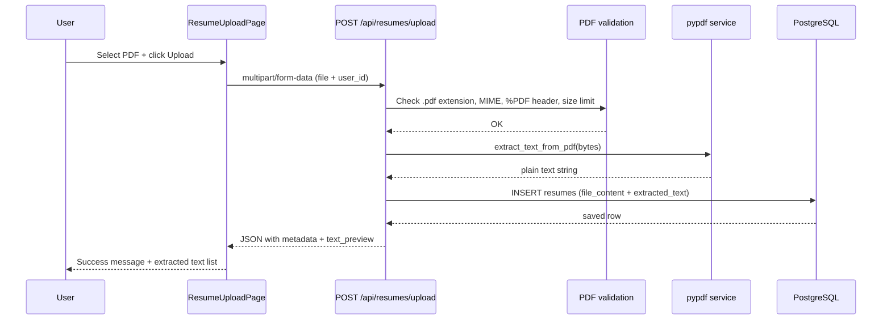

# Resume Upload — Flow

## Database: `resumes` table

| Column | Type | Purpose |
|--------|------|---------|
| `id` | UUID | Primary key |
| `user_id` | UUID | Owner of the resume |
| `filename` | VARCHAR(255) | Original PDF filename |
| `mime_type` | VARCHAR(100) | `application/pdf` |
| `file_size` | INTEGER | Size in bytes |
| `file_content` | BYTEA | Raw PDF stored in PostgreSQL |
| `extracted_text` | TEXT | Plain text extracted from the PDF |
| `created_at` / `updated_at` | TIMESTAMPTZ | Audit timestamps |

## API Endpoints

| Method | Path | Description |
|--------|------|-------------|
| `POST` | `/api/resumes/upload` | Upload PDF (multipart form) |
| `GET` | `/api/resumes?user_id=` | List resumes with extracted text |
| `GET` | `/api/resumes/{id}` | Get one resume |
| `GET` | `/api/resumes/{id}/download` | Download original PDF |

### Upload request (multipart/form-data)

- `user_id` — UUID of the owner
- `file` — PDF file

## Step-by-step flow



## Local setup

```bash
cd backend
pip install -e .
alembic upgrade head
python -m scripts.seed_demo_user
uvicorn app.main:app --reload
```

Open http://localhost:5173/resumes
