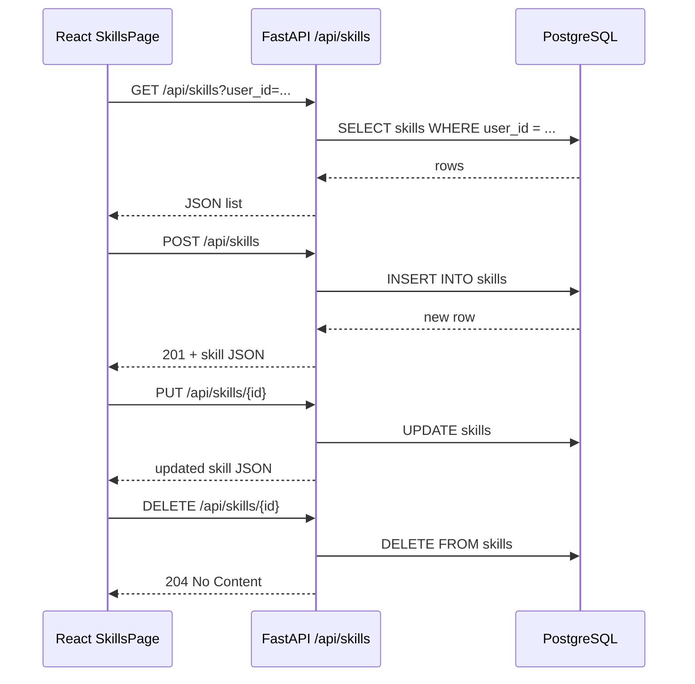

# Skill Management — API & Flow

## API Endpoints

| Method | Path | Description |
|--------|------|-------------|
| `GET` | `/api/skills` | List skills; optional `?user_id=` filter |
| `GET` | `/api/skills/{id}` | Get one skill |
| `POST` | `/api/skills` | Create a skill |
| `PUT` | `/api/skills/{id}` | Update a skill (partial body) |
| `DELETE` | `/api/skills/{id}` | Delete a skill |

### Create request body

```json
{
  "user_id": "00000000-0000-0000-0000-000000000001",
  "name": "Python",
  "category": "Programming",
  "proficiency": "advanced",
  "description": "5 years backend development"
}
```

## End-to-end flow



## Local setup

1. Start database: `docker compose up -d`
2. Run migrations: `cd backend && alembic upgrade head`
3. Seed demo user: `python -m scripts.seed_demo_user` (from `backend/`)
4. Start API: `uvicorn app.main:app --reload --app-dir backend` or from `backend/`: `uvicorn app.main:app --reload`
5. Start UI: `cd frontend && npm install && npm run dev`

Open http://localhost:5173/skills
